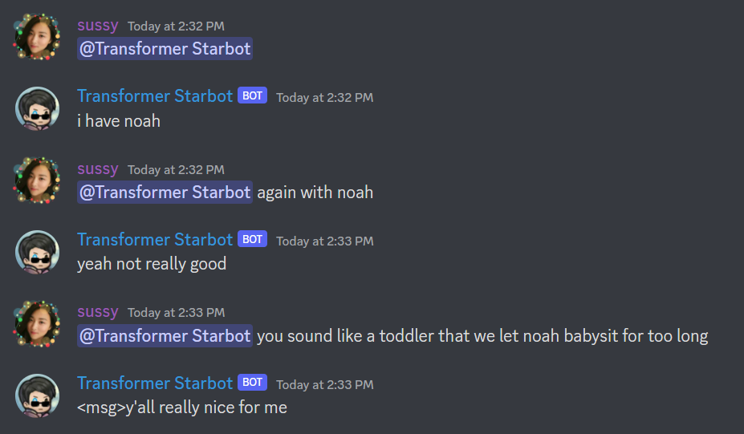
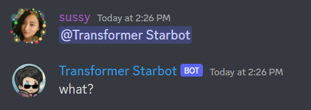

# Starbot Transformers
Final project for CSE 599.

# Abstract
Starbot is a sassy Discord chatbot. He was born (made) in 2019, and his ability to interact with members of a Discord server has been one of his main passtimes (features) ever since. He has gradually been improving his ability to communicate through written text via Discord by studying the language of members he interacts with, and this project aims to take the latest stab at the problem using Huggingface's Transformers library.

# Problem Statement
Starbot's chat system is straightforward. If someone mentions him in a message using @Starbot, he should respond. Originally, his responses were predetermined, but over time, initiatives were created to give him the ability to compose original messages on-demand. This led to the Starbot Natural Language Initiative, or NLI. The goal of the NLI is to teach Starbot how to use text to communicate over the internet, specifically, over Discord channels.

# Related Work
Recent improvements in text generation research has proven the possibility of creating text that is indistinguishable from human authored text. While the models and machines used to generate those pieces of text are as expensive as they are complicated, and Starbot is admittedly stupid and running on little more than a consumer laptop, it is possible to use those giant computers to fine-tune a language model and have Starbot use the model for his own use. 

Models in question are [distilgpt2](https://huggingface.co/distilgpt2) and the dataset being used to fine-tune is a .csv file with over 250,000 Discord messages scraped off of one of my friend's server (with permission, of course).

# Methodology
Using Google CoLab and HuggingFace's libraries, the .csv file was prepared by sifting invalid messages (empty, URLs), then setting everything to lowercase (to simplify the vocabulary space). The messages were padded with specialized <msg> and </msg> tags for use later. Then they were tokenized using the predefined Tokenizer, and fed into the model for fine-tuning. The fine-tuning process took roughly 1 hour 20 minutes running on my local desktop machine, because Colab was too slow and I didn't want to pay $20 for an Amazon machine. Once the training was complete, the model was uploaded to (HuggingFace's network)[https://huggingface.co/wenjalan/starbot-transformers], from which Starbot could download the model and begin generating messages with it.

# Experiments/Evaluation
Several methods of tokenization and padding were used, in order to generate text that wasn't long and continuous and were instead short and simple, more like the nature of an online messaging platform. This proved difficult as DistilGPT-2's training data mostly contained samples that were long and continuous, putting emphasis on the continuous part, which doesn't fit the nature of an online chatroom where messages are usually short and sometimes incomplete.

The model outputted quite high perplexity (in the 2000s) even after training for an hour, indicating that the model was still pretty confused about what the hell was going on in the training examples I gave it.

## Training procedure

### Training hyperparameters

The following hyperparameters were used during training:
- learning_rate: 0.005
- train_batch_size: 8
- eval_batch_size: 8
- seed: 42
- optimizer: Adam with betas=(0.9,0.999) and epsilon=1e-08
- lr_scheduler_type: linear
- num_epochs: 10

### Training results

| Training Loss | Epoch | Step  | Validation Loss |
|:-------------:|:-----:|:-----:|:---------------:|
| 3.3942        | 1.0   | 2992  | 3.3385          |
| 3.2566        | 2.0   | 5984  | 3.2760          |
| 3.4112        | 3.0   | 8976  | 3.4710          |
| 3.4887        | 4.0   | 11968 | 3.5264          |
| 3.4856        | 5.0   | 14960 | 3.5181          |
| 3.4359        | 6.0   | 17952 | 3.5079          |
| 3.4115        | 7.0   | 20944 | 3.4954          |
| 3.3657        | 8.0   | 23936 | 3.4482          |
| 3.3018        | 9.0   | 26928 | 3.4207          |
| 3.2435        | 10.0  | 29920 | 3.4079          |

# Results
Overall, the model is functional, but not fine-tuned to the degree which I would say is satisfactory. The ultimate metric for success, believability, isn't satisfied as the model's outputted messages start off believable but struggle to stay on-course the further it goes on. But it does generate some funny messages sometimes, which is the second-most important metric.

# Examples

# Video